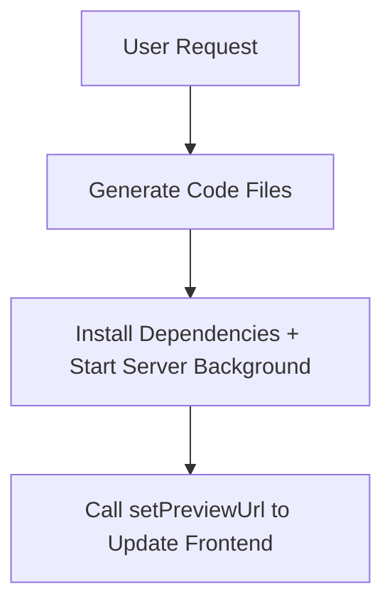

# Dev Server Workflow Design (Simplified)

## Overview
**Simplified workflow**: Projects are initialized by the system at the start of the session. The AI only needs to focus on generating code and starting the server.

---

## Core Assumptions

✅ **Project already initialized** - System automatically creates project at session start
✅ **projectId provided** - AI gets current project ID from context
✅ **Direct file operations** - AI directly creates/modifies files in existing project

---

## Simplified Workflow

### 1. User Request
```
User: "Help me create a simple blog website"
```

### 2. AI Execution Flow (3 steps)


### 3. Detailed Steps

#### Step 1: Generate Files (No need to create project)
```typescript
// AI directly writes files to current project
await writeFile('package.json', packageJsonContent);
await writeFile('index.html', htmlContent);
await writeFile('src/App.jsx', appContent);
await writeFile('src/main.jsx', mainContent);
await writeFile('vite.config.js', viteConfigContent);
```

#### Step 2: Install Dependencies + Start Dev Server
```typescript
// Install dependencies
await executeCommand('npm install');

// Start dev server (background)
const result = await executeCommand('npm run dev', { isDev: true });
// Returns: {
//   success: true,
//   shellId: 'shell_123',
//   previewUrl: 'http://localhost:5173'
// }
```

#### Step 3: Update Frontend Preview
```typescript
// AI calls client tool to directly update iframe URL
await setPreviewUrl(result.previewUrl);
// Frontend iframe automatically loads new URL
```

---

## Tool Design (Agent Tools Layer)

**Core Idea**: Don't modify `project-manager.ts`, encapsulate at AI SDK tools layer

### 1. Agent Tool: startDevServer

#### Tool Definition
```typescript
{
  type: 'function',
  function: {
    name: 'startDevServer',
    description: 'Start development server in background and return preview URL',
    parameters: {
      type: 'object',
      properties: {
        command: {
          type: 'string',
          description: 'Dev server command (e.g., "npm run dev", "bun run dev")'
        },
        timeout: {
          type: 'number',
          description: 'Timeout in milliseconds (default: 30000)',
          default: 30000
        }
      },
      required: ['command']
    }
  }
}
```

#### Implementation Logic
```typescript
// AI SDK tools layer (possibly in app/api/chat/route.ts)
async function startDevServer(command: string, timeout = 30000) {
  const projectId = getCurrentProjectId();

  // 1. Use existing executeCommand, but run in background mode
  // Note: May need to use Node.js child_process
  const { spawn } = require('child_process');
  const projectPath = getProjectPath(projectId);

  const proc = spawn(command, {
    cwd: projectPath,
    shell: true,
    detached: true,
  });

  // 2. Listen to output, wait for URL to appear
  let output = '';
  const startTime = Date.now();

  return new Promise((resolve, reject) => {
    proc.stdout.on('data', (data: Buffer) => {
      output += data.toString();

      // 3. Extract URL
      const url = extractUrl(output);
      if (url) {
        resolve({
          success: true,
          previewUrl: url,
          pid: proc.pid
        });
      }
    });

    // Timeout handling
    setTimeout(() => {
      if (!output.includes('http://localhost')) {
        reject(new Error('Dev server failed to start'));
      }
    }, timeout);
  });
}

// URL extraction helper function
function extractUrl(output: string): string | null {
  const patterns = [
    /Local:\s+(https?:\/\/[^\s]+)/,           // Vite
    /url:\s+(https?:\/\/[^\s]+)/,             // Next.js
    /(https?:\/\/localhost:\d+)/,             // Generic
  ];

  for (const pattern of patterns) {
    const match = output.match(pattern);
    if (match) return match[1];
  }

  return null;
}
```

### 2. Client Tool: setPreviewUrl

#### Tool Definition
```typescript
{
  type: 'function',
  function: {
    name: 'setPreviewUrl',
    description: 'Update the preview iframe URL to display the generated website',
    parameters: {
      type: 'object',
      properties: {
        url: {
          type: 'string',
          description: 'The preview URL (e.g., http://localhost:5173)',
          pattern: '^https?://localhost:\\d+$'
        }
      },
      required: ['url']
    }
  }
}
```

#### Frontend Implementation
```typescript
// lib/client-tools.ts
export async function setPreviewUrl(url: string) {
  // Validate URL format
  if (!url.match(/^https?:\/\/localhost:\d+/)) {
    throw new Error('Invalid preview URL format');
  }

  // Update store
  useProjectStore.getState().setIframeUrl(url);

  return {
    success: true,
    message: `Preview URL updated to ${url}`
  };
}
```

---

## System Prompt Optimization

### Core Instructions

```markdown
# Website Generation Workflow

You are a website generator AI. A project has been initialized for you at the start of this conversation.

## Your Task Flow

When the user asks to create a website:

### 1. Generate Files
- Use `writeFile(path, content)` to create all necessary files
- Include: package.json, HTML, CSS, JS files
- Prefer modern frameworks (Vite + React, Next.js, etc.)
- **Example**:
  ```typescript
  await writeFile('package.json', '{ "name": "my-app", ... }');
  await writeFile('index.html', '<!DOCTYPE html>...');
  await writeFile('src/App.jsx', 'export default function App() { ... }');
  ```

### 2. Install Dependencies & Start Server
- Run `executeCommand('npm install')` first
- Then run `executeCommand('npm run dev', { isDev: true })`
- **The `isDev: true` option will**:
  - Run the server in the background (non-blocking)
  - Automatically extract the preview URL
  - Return `{ success, shellId, previewUrl }`

### 3. Update Preview
- Call `setPreviewUrl(url)` with the extracted URL
- The frontend will automatically load the preview in iframe
- **Example**:
  ```typescript
  const result = await executeCommand('npm run dev', { isDev: true });
  await setPreviewUrl(result.previewUrl); // e.g., http://localhost:5173
  ```

## Important Rules

✅ **DO**:
- Always use `isDev: true` when starting dev servers
- Always call `setPreviewUrl()` after starting the server
- Use `npm run dev` or equivalent dev command
- Wait for `npm install` to complete before starting server

❌ **DON'T**:
- Don't use `createProject()` (project already exists)
- Don't forget to call `setPreviewUrl()`
- Don't run dev servers without `isDev: true`
- Don't use blocking commands for servers

## Example Workflow

User: "Create a React app with a homepage"

Steps:
1. Generate package.json with Vite + React dependencies
2. Generate index.html, src/App.jsx, src/main.jsx, vite.config.js
3. Run `executeCommand('npm install')`
4. Run `executeCommand('npm run dev', { isDev: true })`
5. Extract URL from result (e.g., http://localhost:5173)
6. Call `setPreviewUrl('http://localhost:5173')`
7. Done! User can see preview in iframe

## Troubleshooting

- If port is occupied, add `-- --port 3001` to command
- If install fails, check package.json syntax
- If server doesn't start, check for error in output
```

---

## Frontend State Management

### Store Update

```typescript
// lib/store.ts (already exists, ensure it has setIframeUrl)
interface ProjectGeneratorStore {
  currentProject: ProjectInfo | null;
  iframeUrl: string;

  setIframeUrl: (url: string) => void;
}
```

### IframeContainer Update

```typescript
// components/iframe/IframeContainer.tsx
export function IframeContainer() {
  const iframeUrl = useProjectStore((state) => state.iframeUrl);

  return (
    <div className="flex flex-col h-full">
      {/* ... tabs ... */}
      <iframe
        src={iframeUrl || 'about:blank'}
        className="w-full h-full border rounded-lg"
        sandbox="allow-scripts allow-same-origin"
      />
    </div>
  );
}
```

---

## Test Scenarios

### Scenario 1: Vite + React
```bash
User: "Create a React app"

AI Actions:
1. writeFile('package.json', ...) - Vite + React deps
2. writeFile('index.html', ...)
3. writeFile('src/App.jsx', ...)
4. writeFile('src/main.jsx', ...)
5. executeCommand('npm install')
6. executeCommand('npm run dev', { isDev: true })
   → Returns: { previewUrl: 'http://localhost:5173' }
7. setPreviewUrl('http://localhost:5173')

Expected Result:
✅ Dev server running in background
✅ Preview shows in iframe
✅ User can interact with the app
```

### Scenario 2: Static HTML
```bash
User: "Create a simple HTML page"

AI Actions:
1. writeFile('index.html', ...)
2. writeFile('style.css', ...)
3. writeFile('script.js', ...)
4. writeFile('package.json', ...) - http-server or serve
5. executeCommand('npm install')
6. executeCommand('npx serve', { isDev: true })
   → Returns: { previewUrl: 'http://localhost:3000' }
7. setPreviewUrl('http://localhost:3000')

Expected Result:
✅ Static server running
✅ HTML page shows in iframe
```

---

## Technical Implementation Priority

### Phase 1 (MVP) - Must Implement
- [ ] **Agent Tool: startDevServer** - Implement in app/api/chat/route.ts
- [ ] **Agent Tool: setPreviewUrl** - Call client-side function
- [ ] **Client Tool: setPreviewUrl** - Implement in lib/client-tools.ts
- [ ] **URL extraction logic** - extractUrl helper function
- [ ] **System prompt optimization** - Add tool usage instructions

### Phase 2 (Enhancement) - Optional
- [ ] Automatic port allocation (increment if occupied)
- [ ] Process health check
- [ ] Streaming logs output to frontend
- [ ] Graceful shutdown of dev server

---

## API Design Summary

### Agent Tools (app/api/chat/route.ts layer)

```typescript
// Tools available to AI

// 1. startDevServer - Start dev server (background)
{
  name: 'startDevServer',
  execute: async (command: string, timeout?: number) => {
    // Use child_process.spawn to start background process
    // Listen to output, extract URL
    // Return: { success: true, previewUrl: 'http://localhost:5173', pid: 12345 }
  }
}

// 2. setPreviewUrl - Update frontend iframe URL (client-side)
{
  name: 'setPreviewUrl',
  execute: async (url: string) => {
    // Call client-side function to update store
    // Return: { success: true, message: 'Preview updated' }
  }
}
```

### Client Tools (lib/client-tools.ts)

```typescript
// Tools available on frontend (called by agent tools)

export async function setPreviewUrl(url: string): Promise<{
  success: boolean;
  message: string;
}> {
  // Validate URL
  if (!url.match(/^https?:\/\/localhost:\d+/)) {
    throw new Error('Invalid preview URL');
  }

  // Update store
  useProjectStore.getState().setIframeUrl(url);

  return {
    success: true,
    message: `Preview URL updated to ${url}`
  };
}
```

### Bottom Layer Unchanged
```typescript
// lib/project-manager.ts - Keep unchanged!

// Existing functions continue to be used, no need to modify
export async function executeCommand(
  command: string
): Promise<{ success: boolean; output: string; error?: string }>;

export async function writeFile(
  filePath: string,
  content: string
): Promise<{ success: boolean }>;
```

---

## Next Steps

1. ✅ **Design document complete** - Simplified workflow
2. ⏭️ **Implement executeCommand enhancement** - Add isDev parameter
3. ⏭️ **Create setPreviewUrl client tool** - Frontend preview update
4. ⏭️ **Optimize system prompt** - Add simplified flow instructions
5. ⏭️ **End-to-end testing** - Vite + React example

---

*Last Updated: 2025-10-12*
*Version: 2.0 (Simplified)*
